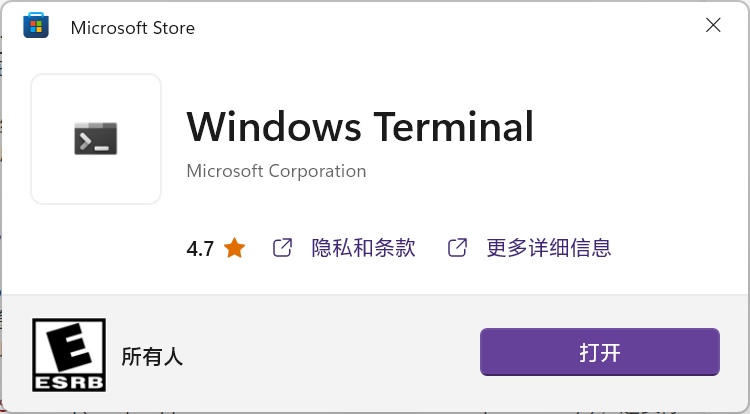
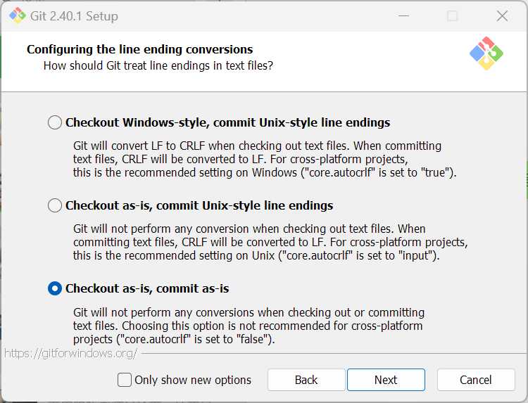

# 格点 QCD 软件简介

## 1. 操作系统和软件准备

我们将简单介绍一些操作系统和软件上的准备，以使你的个人电脑能够运行格点 QCD 所需的软件。

我们不太建议在你的个人电脑上直接运行组态生成和传播子求解的程序，因为这些程序往往需要数量众多的 CPU 核心或者 GPU 进行运算，很难在个人电脑上获得有实际意义的结果。但考虑到对于软件尝试性的使用和调试可能可以从本地安装中受益，我们仍然建议你阅读下面的部分，来大致了解格点 QCD 软件编译和运行的步骤。

### a. Linux

大部分的格点 QCD 软件都是基于 Linux 编写的。在使用集群甚至超级计算机时，它们也都搭载 Linux 操作系统，因此基本的 Linux 命令行操作是格点 QCD 研究人员必需的技能。

Linux 拥有众多的发行版，每个发行版的操作会有些许不同。总的来看，国内现有的计算资源大都使用 CentOS 发行版，而对于桌面系统则以 Ubuntu 为主流，因此我们主要基于这两个发行版进行说明。事实上，Red Hat (CentOS, Fedora) 和 Debian (Ubuntu, Deepin) 就是目前两个使用最广泛的发行版派系，一般总能找到对应的操作方式。至于 Arch (Manjaro)，你都用 Arch 了，我相信你总可以找到对应的文档。

### b. Windows

作为最常用的桌面操作系统，Windows 10 在开发者体验方面有了长足进步，强烈建议将 Windows 升级至 19041 (2004) 及以上。

可以通过 `win+R` 唤起“运行”窗口，输入 `winver` 并确定后会弹出窗口，在这里你可以确认你的 Windows 版本。


#### Terminal

Windows 11 随附了 [Windows Terminal](https://github.com/microsoft/terminal)，并作为默认终端使用。Windows 10 可以通过 [Microsoft Store](https://apps.microsoft.com/store/detail/windows-terminal/9N0DX20HK701) 安装这一终端，但是无法设置为默认终端，需要手动调用。尽管如此，我们仍然强烈建议你安装这一终端，因为古老的蓝底 PowerShell 终端早该丢到历史的垃圾堆了。



通常，我们建议将其固定到任务栏并使用 `win+number` 快捷键呼出终端。

#### Git

Git 有一个专门的 [Git for Windows](https://github.com/git-for-windows/git) 版本，用于在 Windows 上添加 `git` 命令支持。在 [GitHub](https://github.com/git-for-windows/git/releases/latest) 发布页面选择相应的版本（推荐 Git-\<version\>-64-bit.exe）下载安装即可。需要注意的是，如图所示在 Configuring the line ending conversions 页面，更改选择为 Checkout as-is, commit as-is。



安装完成后，在终端输入 `git`，若出现帮助信息说明安装正常完成了。

#### Python

在 [Python](https://www.python.org/downloads/) 的官网页面选择相应的版本，例如 3.11.3，在最下方的列表中选择 Windows installer (64-bit) 下载安装即可。


安装完成后，在终端输入 `py`，若未提示报错，且正常进入了 Python 命令交互界面，说明安装正常完成了。


#### Visual Studio

Visual Studio 是 Microsoft 推出的一款主要支持 C++ 和 C# 的集成开发环境。Windows 并不随附 C/C++ 编译器，而某些需要源码安装的 Python 包则需要 Windows 上的编译器，因此需要通过 Visual Studio 安装这些工具。

下载 [Visual Studio](https://visualstudio.microsoft.com/zh-hans/)，这实际上是一个安装器，通过这个安装器可以管理我们需要的 Visual Studio 组件。安装完成后启动 Visual Studio Installer，选中左侧的“使用 C++ 的桌面开发”，右侧至少保留如图所示的两项，安装即可。


#### Visual Studio Code

Visual Studio Code (VSCode) 虽然与 Visual Studio 有着相似的名称，但是其本质完全不同。VSCode 是一个开源的编辑器，功能没有 VS 强大，但是可以通过繁多的插件支持多种编程语言。

下载 [VSCode](https://code.visualstudio.com/Download) 并安装即可，推荐 User Installer。


#### WSL

Windows Subsystem for Linux (WSL) 是微软在 Windows 10 引入的子系统，可以在 Windows 上近乎无缝地获得 Linux 体验。配合 VSCode 的 WSL 扩展，对于格点 QCD 来说的开发体验实际已经超过了 macOS。启动终端，在命令行中输入

```PowerShell
wsl --install
```

根据提示操作就可以启用 WSL 需要的系统功能，并安装默认的 Ubuntu 发行版。可以通过 `wsl --list --online` 命令列出所有可用的发行版，并通过 `wsl --install <Distro>` 替换为相应的 `NAME` 项来安装需要的发行版。这一步可能需要重启 Windows。

如果一切顺利，你将会在终端的新建下拉菜单中看到相应的发行版。按照提示完成一些初始化例如账户密码设置等步骤后，就可以通过这种方式运行 WSL。另一方面，你可以直接在命令行中输入 `wsl` 来进入已安装的发行版。

你可以在资源管理器的路径区域输入 `\\wsl.localhost`，选择安装的发行版，就可以直接通过 Windows 资源管理器浏览 WSL 中的文件。反过来，在 WSL 中，`/mnt/c` 则对应于 Windows 系统的 `C:` 盘。

### c. macOS

macOS 是一种 UNIX 操作系统，其环境与 Linux 略有不同，但大体上相近。相比 Linux 它有原生且优美的图形界面，因此经常有人说 macOS 是最适合程序员的操作系统。根据 [Homebrew 官网介绍](https://docs.brew.sh/Installation#2)，我们建议将 macOS 升级到 11 (Big Sur) 及以上。

#### Xcode CLI

与 Windows 相同，macOS 并没有直接随附我们需要的各种命令行工具。启动 `终端.app`，输入

```zsh
xcode-select --install
```

根据提示操作就可以安装一些 Apple 提供的命令行工具，包括 `git` 和 `python3`等等。

#### Homebrew

Homebrew 是 macOS 上最受欢迎的包管理工具。它通过预编译二进制包的形式提供了 macOS 开发需要的各种命令行软件和库。在终端中输入

```zsh
/bin/bash -c "$(curl -fsSL https://raw.githubusercontent.com/Homebrew/install/HEAD/install.sh)"
```

现在，你可以使用 `brew install <package>` 安装你需要的软件和库了。
