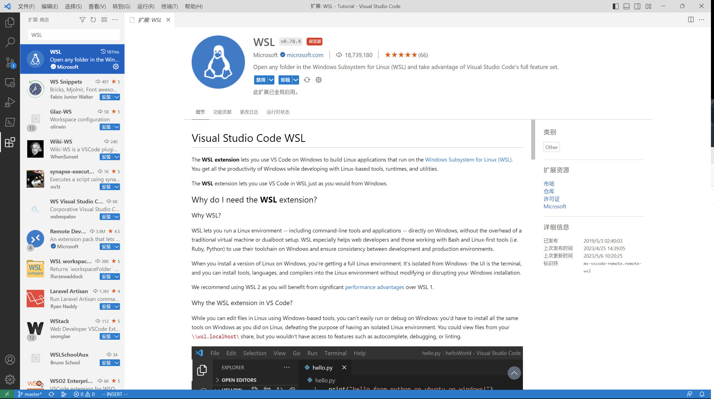

# WSL

Windows Subsystem for Linux (WSL) 是微软在 Windows 10 引入的子系统，可以在 Windows 上近乎无缝地获得 Linux 体验。配合 VSCode 的 WSL 扩展，对于格点 QCD 来说的开发体验实际已经超过了 macOS。

## 安装

启动终端，在命令行中输入

```PowerShell
wsl --install
```

根据提示操作就可以启用 WSL 需要的系统功能，并安装默认的 Ubuntu 发行版。这一步可能需要重启 Windows。

可以通过 `wsl --list --online` 命令列出所有可用的发行版，

```PowerShell
wsl --list --online
以下是可安装的有效分发的列表。
使用 'wsl.exe --install <Distro>' 安装。

NAME                                   FRIENDLY NAME
Ubuntu                                 Ubuntu
Debian                                 Debian GNU/Linux
kali-linux                             Kali Linux Rolling
Ubuntu-18.04                           Ubuntu 18.04 LTS
Ubuntu-20.04                           Ubuntu 20.04 LTS
Ubuntu-22.04                           Ubuntu 22.04 LTS
OracleLinux_7_9                        Oracle Linux 7.9
OracleLinux_8_7                        Oracle Linux 8.7
OracleLinux_9_1                        Oracle Linux 9.1
SUSE-Linux-Enterprise-Server-15-SP4    SUSE Linux Enterprise Server 15 SP4
openSUSE-Leap-15.4                     openSUSE Leap 15.4
openSUSE-Tumbleweed                    openSUSE Tumbleweed
```

通过将对应的 `NAME` 项填入 `wsl --install` 之后可以安装相应的发行版。例如若想要安装 Debian，那么输入以下命令并回车。

```PowerShell
wsl --install Debian
```

如果一切顺利，你将会在终端的新建下拉菜单中看到相应的发行版。按照提示完成一些初始化例如账户密码设置等步骤后，就可以通过这种方式运行 WSL。另一方面，你可以直接在命令行中输入 `wsl` 来进入已安装的发行版。

你可以在资源管理器的路径区域输入 `\\wsl.localhost`，选择安装的发行版，就可以直接通过 Windows 资源管理器浏览 WSL 中的文件。反过来，在 WSL 中，`/mnt/c` 则对应于 Windows 系统的 `C:` 盘。

其他关于 Linux 操作系统的内容参见 [Linux](./Linux.md)。

## VSCode 集成

首先在 Windows 中安装 VSCode，参见 [Windows](./Windows.md#visual-studio-code)。启动 VSCode，通过 `Ctrl+Shift+X` 唤出扩展商店，在搜索框输入 `WSL`，选择相应名称的扩展详情并点击安装。



点击 VSCode 最左下角的符号，可以看到有一项“连接到 WSL”的选项，选中后就可以在 WSL 中启动 VSCode，并使用原生的 Linux 环境。
