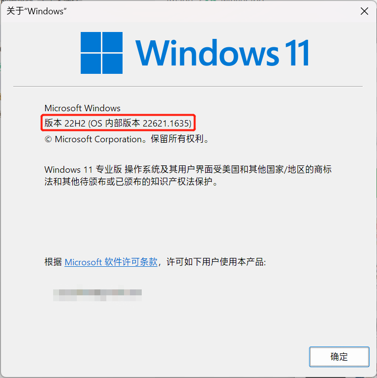
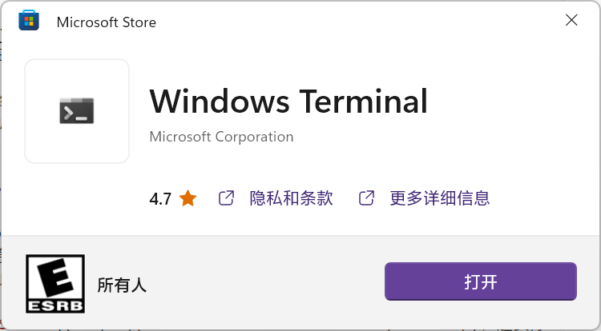
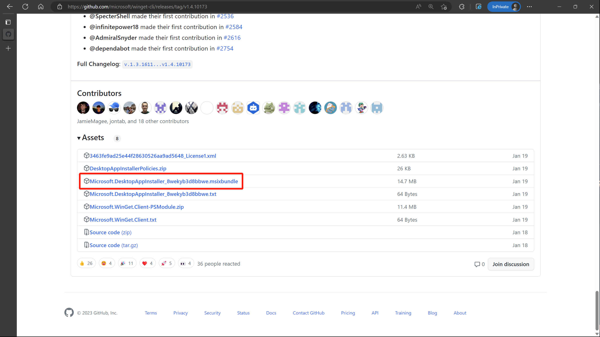
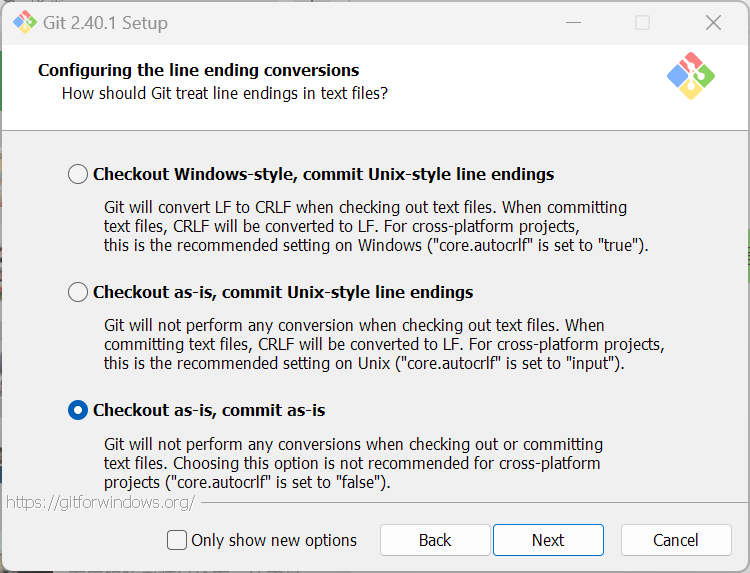
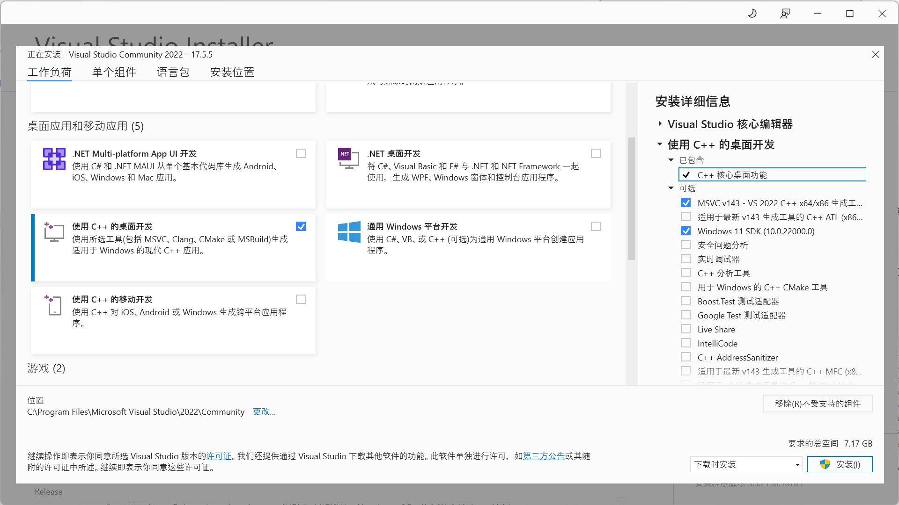

# Windows

作为最常用的桌面操作系统，Windows 10 在开发者体验方面有了长足进步，强烈建议将 Windows 升级至 19041 (2004) 及以上。

可以通过 `win+R` 唤起“运行”窗口，输入 `winver` 并确定后会弹出窗口，在这里你可以确认你的 Windows 版本。



## Windows Terminal

Windows 11 随附了 [Windows Terminal](https://github.com/microsoft/terminal)，并作为默认终端使用。Windows 10 可以通过 [Microsoft Store](https://apps.microsoft.com/store/detail/windows-terminal/9N0DX20HK701) 安装这一终端，但是无法设置为默认终端，需要手动调用。尽管如此，我们仍然强烈建议你安装这一终端，因为古老的蓝底 PowerShell 终端早该丢到历史的垃圾堆了。



通常，我们建议将其固定到任务栏并使用 `win+number` 快捷键呼出终端。

## WinGet

WinGet 是 Microsoft 推出的 Windows 包管理工具。不过与其说它是包管理工具，不如说是一个软件仓库合集。它没有正常包管理工具的各种依赖处理，仅仅是下载并安装各个软件。

Windows 11 随附了 WinGet。若你使用的是 Windows 10，在 [GitHub](https://github.com/microsoft/winget-cli/releases/latest) 发布页面下载最新的 WinGet 命令行工具并安装（以 `msixbundle` 结尾的文件）。



完成后在终端中输入以下命令并回车，

```PowerShell
winget upgrade
```

你应当需要同意数个协议才能够使用 WinGet。现在你可以通过 `winget install <package>` 和 `winget upgrade <package>` 来安装和更新软件。例如你可以使用

```PowerShell
winget upgrade Microsoft.WindowsTerminal
```

来将 Windows Terminal 更新到最新版本。

你可以通过使用 `winget search <package>` 来搜索你想要安装的软件的名称。例如 `winget search cmake`，你可以得到结果

```PowerShell
winget search cmake
名称                  ID                                版本   匹配       源
--------------------------------------------------------------------------------
CMake                 Kitware.CMake                     3.26.3            winget
Conan Package Manager JFrog.Conan                       2.0.4  Tag: cmake winget
Discord RPC Maker     ThatOneCalculator.DiscordRPCMaker 2.1.1             winget
```

我们想要安装的是第一个结果，将 `ID` 一栏的值填入 `winget install` 之后，即

```PowerShell
winget install Kitware.CMake
```

就可以安装 Windows 版本的 CMake 软件。有时我们希望修改某些软件的安装配置，那么可以添加 `-i` 参数启动交互式安装。

```PowerShell
winget install -i Kitware.CMake
```

## Git

Git 有一个专门的 [Git for Windows](https://github.com/git-for-windows/git) 版本，用于在 Windows 上添加 `git` 命令支持。在终端中输入以下命令并回车，

```PowerShell
winget install -i Git.Git
```

这里我们启用了交互式安装，这是因为有一个默认选项需要修改。如图所示在 Configuring the line ending conversions 页面，更改选择为 Checkout as-is, commit as-is。



安装完成后，在终端输入 `git`，若出现帮助信息说明安装正常完成了。

```PowerShell
git
usage: git [-v | --version] [-h | --help] [-C <path>] [-c <name>=<value>]
           [--exec-path[=<path>]] [--html-path] [--man-path] [--info-path]
           [-p | --paginate | -P | --no-pager] [--no-replace-objects] [--bare]
           [--git-dir=<path>] [--work-tree=<path>] [--namespace=<name>]
           [--config-env=<name>=<envvar>] <command> [<args>]

These are common Git commands used in various situations:

start a working area (see also: git help tutorial)
   clone     Clone a repository into a new directory
   init      Create an empty Git repository or reinitialize an existing one

work on the current change (see also: git help everyday)
   add       Add file contents to the index
   mv        Move or rename a file, a directory, or a symlink
   restore   Restore working tree files
   rm        Remove files from the working tree and from the index

examine the history and state (see also: git help revisions)
   bisect    Use binary search to find the commit that introduced a bug
   diff      Show changes between commits, commit and working tree, etc
   grep      Print lines matching a pattern
   log       Show commit logs
   show      Show various types of objects
   status    Show the working tree status

grow, mark and tweak your common history
   branch    List, create, or delete branches
   commit    Record changes to the repository
   merge     Join two or more development histories together
   rebase    Reapply commits on top of another base tip
   reset     Reset current HEAD to the specified state
   switch    Switch branches
   tag       Create, list, delete or verify a tag object signed with GPG

collaborate (see also: git help workflows)
   fetch     Download objects and refs from another repository
   pull      Fetch from and integrate with another repository or a local branch
   push      Update remote refs along with associated objects

'git help -a' and 'git help -g' list available subcommands and some
concept guides. See 'git help <command>' or 'git help <concept>'
to read about a specific subcommand or concept.
See 'git help git' for an overview of the system.
```

## Python

使用 WinGet 搜索 Python，

```PowerShell
winget search python3
名称        ID                  版本        匹配             源
-------------------------------------------------------------------
Python 3.11 Python.Python.3.11  3.11.3      Moniker: python3 winget
Miniconda3  Anaconda.Miniconda3 py39_4.10.3 Command: python3 winget
Anaconda3   Anaconda.Anaconda3  2023.03     Command: python3 winget
Python 3    Python.Python.3.9   3.9.13      Tag: python3     winget
Python 3    Python.Python.3.8   3.8.10      Tag: python3     winget
Python 3    Python.Python.3.7   3.7.9       Tag: python3     winget
Python 3    Python.Python.3.6   3.6.8       Tag: python3     winget
Python 3    Python.Python.3.5   3.5.4       Tag: python3     winget
Python 3    Python.Python.3.4   3.4.4       Tag: python3     winget
Python 3    Python.Python.3.3   3.3.5       Tag: python3     winget
Python 3    Python.Python.3.2   3.2.5       Tag: python3     winget
Python 3    Python.Python.3.12  3.12.0a5    Tag: python3     winget
Python 3.10 Python.Python.3.10  3.10.10     Tag: python3     winget
Python 3    Python.Python.3.1   3.1.4       Tag: python3     winget
Python 3    Python.Python.3.0   3.0.1       Tag: python3     winget
Python 2    Python.Python.2     2.7.18150   Tag: python3     winget
```

选择你需要的版本，例如 3.11，输入以下命令并回车以安装对应版本的 Python 解释器。

```Powershell
winget install Python.Python.3.11
```

安装完成后，在终端输入 `py`，若未提示报错，且正常进入了 Python 命令交互界面，说明安装正常完成了。

```PowerShell
py
Python 3.11.3 (tags/v3.11.3:f3909b8, Apr  4 2023, 23:49:59) [MSC v.1934 64 bit (AMD64)] on win32
Type "help", "copyright", "credits" or "license" for more information.
>>>
```

## Visual Studio

Visual Studio 是 Microsoft 推出的一款主要支持 C++ 和 C# 的集成开发环境。Windows 并不随附 C/C++ 编译器，而某些需要源码安装的 Python 包则需要 Windows 上的编译器，因此需要通过 Visual Studio 安装这些工具。

使用 WinGet 搜索 Visual Studio，

```PowerShell
winget search visualstudio
名称                                    ID                                               版本         匹配              源
------------------------------------------------------------------------------------------------------------------------------
IsWiX                                   IsWiX.IsWiX                                      4.15.35.0    Tag: visualstudio winget
Visual Studio Professional 2022 Preview Microsoft.VisualStudio.2022.Professional.Preview 17.6.0       Tag: visualstudio winget
Visual Studio Community 2022 Preview    Microsoft.VisualStudio.2022.Community.Preview    17.6.0       Tag: visualstudio winget
Visual Studio Enterprise 2022 Preview   Microsoft.VisualStudio.2022.Enterprise.Preview   17.6.0       Tag: visualstudio winget
Microsoft Visual Studio Code Insiders   Microsoft.VisualStudioCode.Insiders              1.79.0                         winget
Microsoft Visual Studio Code            Microsoft.VisualStudioCode                       1.78.0                         winget
Visual Studio Locator                   Microsoft.VisualStudio.Locator                   3.1.4                          winget
Visual Studio Professional 2022         Microsoft.VisualStudio.2022.Professional         17.5.5                         winget
Visual Studio Enterprise 2022           Microsoft.VisualStudio.2022.Enterprise           17.5.5                         winget
Visual Studio BuildTools 2022           Microsoft.VisualStudio.2022.BuildTools           17.5.5                         winget
Visual Studio Professional 2019         Microsoft.VisualStudio.2019.Professional         16.11.26                       winget
Visual Studio Enterprise 2019           Microsoft.VisualStudio.2019.Enterprise           16.11.26                       winget
Visual Studio BuildTools 2019           Microsoft.VisualStudio.2019.BuildTools           16.11.26                       winget
Visual Studio Community 2022            Microsoft.VisualStudio.2022.Community            17.5.5                         winget
Visual Studio Configuration Finder      Microsoft.VisualStudio.ConfigFinder              1.0.47.55350                   winget
```

通常选择 Community 版本，2019 和 2022 则区别不大。以 Visual Studio Community 2022 为例，输入以下命令并回车，

```PowerShell
winget install Microsoft.VisualStudio.2022.Community
```

这实际上下载了一个安装器，通过这个安装器可以管理我们需要的 Visual Studio 组件。安装完成后启动 Visual Studio Installer，选中左侧的“使用 C++ 的桌面开发”，右侧至少保留如图所示的两项，点击右下角安装即可。



## Visual Studio Code

Visual Studio Code (VSCode) 虽然与 Visual Studio 有着相似的名称，但是其本质完全不同。VSCode 是一个开源的编辑器，功能没有 VS 强大，但是可以通过繁多的插件支持多种编程语言。

使用 WinGet 搜索 Visual Studio Code，

```PowerShell
winget search visualstudiocode
名称                                  ID                                  版本   源
----------------------------------------------------------------------------------------
Microsoft Visual Studio Code Insiders Microsoft.VisualStudioCode.Insiders 1.79.0 winget
Microsoft Visual Studio Code          Microsoft.VisualStudioCode          1.78.0 winget
```

通常不选择内测版本，因此输入以下命令并回车，

```PowerShell
winget install Microsoft.VisualStudioCode
```

关于 VSCode 更多的使用方法，参见 [VSCode](./VSCode.md)。
